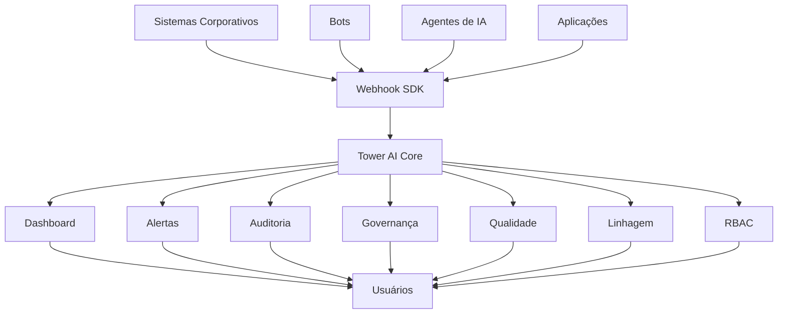
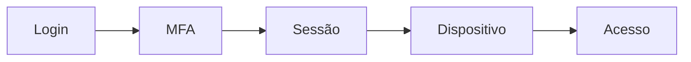
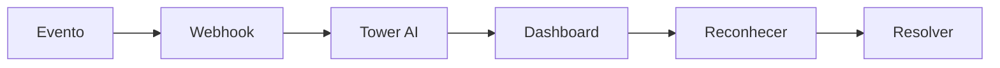
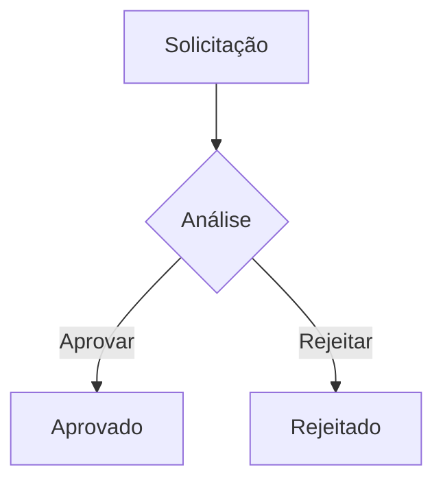
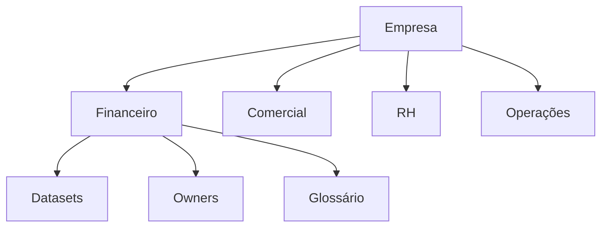
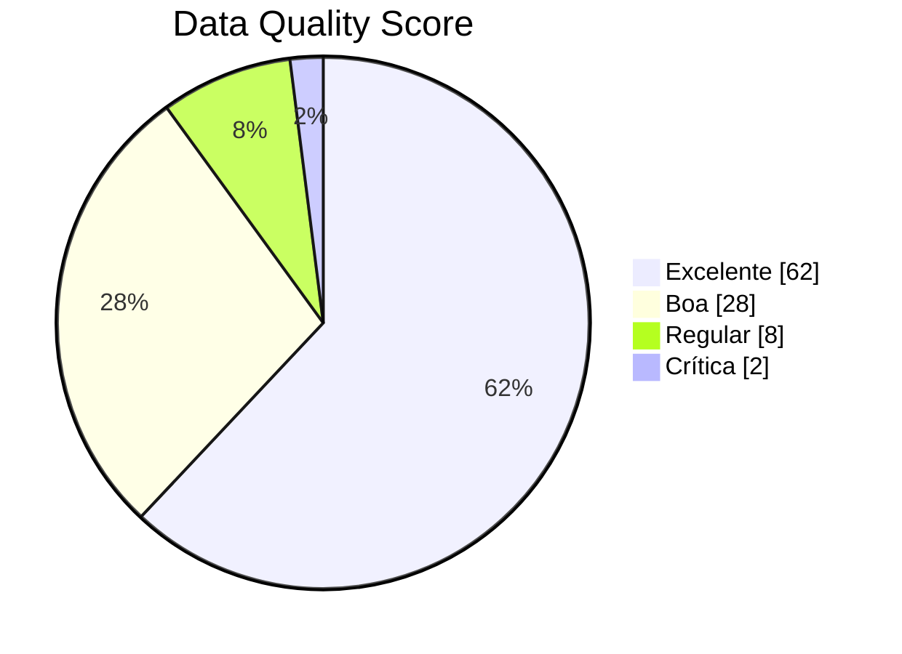
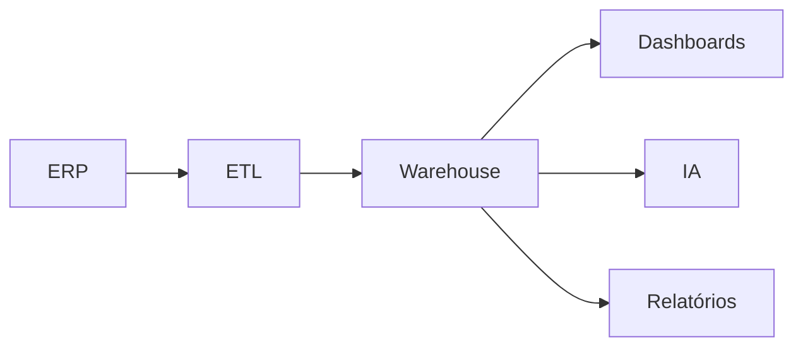
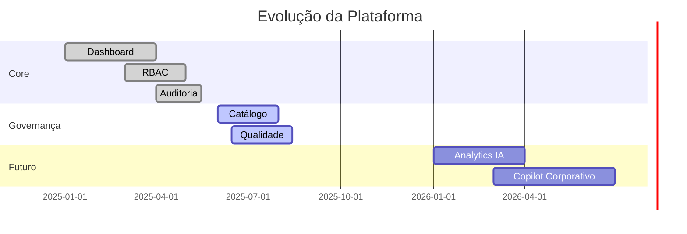

<div align="center">


<br>


<br>


</div>

---

# Visão Geral

O **Tower AI** é uma plataforma de governança corporativa, segurança da informação e qualidade de dados desenvolvida para transformar qualquer smartphone ou navegador em um centro de decisão em tempo real.

A plataforma centraliza:

```text
Governança de Dados
Segurança
Compliance
Auditoria
Observabilidade
Monitoramento
Qualidade de Dados
Integrações com IA
```

Tudo em um único ambiente.

---

# Arquitetura



---

# Dashboard em Tempo Real

### Centro de Operações

```text
┌───────────────────────────────────────┐
│ ALERTAS ATIVOS                  1.284 │
│ INCIDENTES CRÍTICOS               12 │
│ DATASETS MONITORADOS            2.548 │
│ QUALIDADE MÉDIA                 94%  │
│ COMPLIANCE SCORE                97%  │
└───────────────────────────────────────┘
```

---

## Performance Operacional

```text
Alertas Resolvidos

██████████████████████████████ 98%

Disponibilidade

█████████████████████████████ 99%

Compliance

████████████████████████████ 96%

Qualidade dos Dados

███████████████████████████ 94%
```

---

# Segurança Corporativa

## Autenticação



### Recursos

* Login Seguro
* MFA
* Sessões Ativas
* Dispositivos Conectados
* Revogação de Sessões
* Proteção contra acessos indevidos

---

# RBAC

Controle granular por cargo.

```text
┌─────────────┬──────┬──────┬──────┬────────────┐
│ Recurso     │ CISO │ SOC  │ AUD  │ Compliance │
├─────────────┼──────┼──────┼──────┼────────────┤
│ Dashboard   │  ✓   │  ✓   │  ✓   │     ✓      │
│ Alertas     │  ✓   │  ✓   │  ✓   │     ✓      │
│ Políticas   │  ✓   │  ✕   │  ✓   │     ✓      │
│ RBAC        │  ✓   │  ✕   │  ✕   │     ✕      │
│ Auditoria   │  ✓   │  ✓   │  ✓   │     ✓      │
└─────────────┴──────┴──────┴──────┴────────────┘
```

### Recursos

* Bloqueio de Rotas
* Permissões por Tela
* Permissões por Ação
* Controle por Cargo

---

# Proteção de Dados

## PII Masking

```text
CPF

123.456.789-00

↓

***.***.***-00
```

```text
EMAIL

usuario@empresa.com

↓

u*******@empresa.com
```

---

## Column Level Security

Controle de quais campos cada perfil pode visualizar.

---

# Sistema de Alertas

Monitoramento contínuo via WebSocket.



---

## Severidades

| Nível    | Impacto    |
| -------- | ---------- |
| Critical | Muito Alto |
| High     | Alto       |
| Medium   | Médio      |
| Low      | Baixo      |

---

## Recursos

* Tempo Real
* Filtros Avançados
* Reconhecimento
* Resolução
* Histórico
* Pesquisa

---

# Aprovações Human-in-the-Loop



### Recursos

* Aprovar
* Rejeitar
* Histórico
* Integração por Webhook

---

# Auditoria

Rastreabilidade completa.

```text
Usuário
    │
    ▼
Ação
    │
    ▼
Data/Hora
    │
    ▼
IP
    │
    ▼
Resultado
```

---

### Recursos

* Audit Log
* Logs Paginados
* Histórico Completo
* Pesquisa Avançada
* Rastreamento por Usuário
* Rastreamento por IP

---

# Governança e Compliance

## Políticas

Compatível com:

```text
LGPD
GDPR
ISO 27001
Políticas Internas
Frameworks Corporativos
```

---

# Catálogo de Dados

Inventário corporativo de ativos.



---

### Recursos

* Catálogo de Datasets
* Metadados
* Data Owners
* Glossário Corporativo

---

# Qualidade de Dados

### Indicadores

```text
Completude

██████████████████████████ 95%

Precisão

████████████████████████ 92%

Consistência

███████████████████████ 90%

Atualização

███████████████████████████ 98%
```

---

## Data Quality Score



---

### Recursos

* Regras de Validação
* SLAs
* Data Quality Score
* Alertas Automáticos

---

# Linhagem de Dados

Visualização completa da origem dos dados.



---

## Recursos

* OpenLineage
* Data Lineage
* Impact Analysis
* Dependências

---

# SDK Universal

Integração com qualquer sistema.

```python
tower.alert(
    "Servidor caiu",
    "CPU 100%",
    source="Sistema do Cliente"
)
```

---

# Integrações

```text
Python
Node.js
Java
Go
PHP
C#
Bots
Agentes de IA
Sistemas Legados
ERP
CRM
```

---

# Relatórios

Exportação profissional.

```text
PDF
Auditoria
Compliance
Qualidade
Governança
Executivo
```

---

# Progressive Web App

Instale o Tower AI como aplicativo.

```text
Android     ✓
iPhone      ✓
Tablet      ✓
Desktop     ✓
```

---

# Dark & Light Mode

```text
LIGHT MODE

████████████████████████████

DARK MODE

▓▓▓▓▓▓▓▓▓▓▓▓▓▓▓▓▓▓▓▓▓▓▓▓▓▓
```

---

# Dados de Demonstração

Os dados de seed existem apenas para demonstrações.

Quando um cliente integra seu ambiente:

```text
Seed Data
      +
Dados Reais
      =
Ambiente Operacional
```

Sem conflitos.

Para produção:

```javascript
removeSeedData();
```

---

# Diferenciais

```diff
+ Mobile First
+ PWA
+ Tempo Real
+ WebSocket
+ Governança de Dados
+ Segurança Corporativa
+ Compliance
+ OpenLineage
+ Data Quality
+ Auditoria Completa
+ Human-in-the-Loop
+ SDK Universal
+ Integração com IA
+ RBAC Granular
+ PII Masking
+ Column Security
```

---

# Roadmap



---

<div align="center">

# TOWER AI

### Governança • Segurança • Compliance • Observabilidade

Monitoramento Inteligente para Empresas Modernas

---

**Transformando dados, segurança e decisões em tempo real.**

</div>
